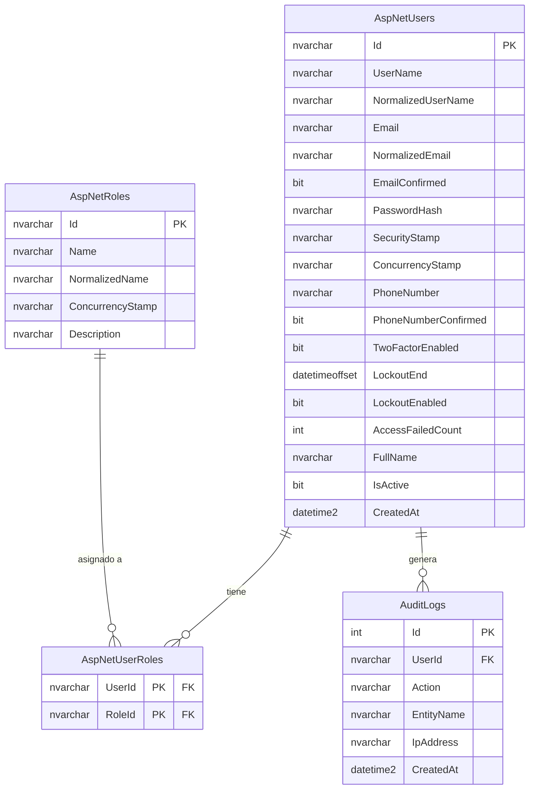

```mermaid
erDiagram
    AspNetUsers {
        nvarchar Id PK
        nvarchar UserName
        nvarchar NormalizedUserName
        nvarchar Email
        nvarchar NormalizedEmail
        bit EmailConfirmed
        nvarchar PasswordHash
        nvarchar SecurityStamp
        nvarchar ConcurrencyStamp
        nvarchar PhoneNumber
        bit PhoneNumberConfirmed
        bit TwoFactorEnabled
        datetimeoffset LockoutEnd
        bit LockoutEnabled
        int AccessFailedCount
        nvarchar FullName
        bit IsActive
        datetime2 CreatedAt
    }

    AspNetRoles {
        nvarchar Id PK
        nvarchar Name
        nvarchar NormalizedName
        nvarchar ConcurrencyStamp
        nvarchar Description
    }

    AspNetUserRoles {
        nvarchar UserId PK "FK"
        nvarchar RoleId PK "FK"
    }

    AuditLogs {
        int Id PK
        nvarchar UserId FK
        nvarchar Action
        nvarchar EntityName
        nvarchar IpAddress
        datetime2 CreatedAt
    }

    AspNetUsers ||--o{ AspNetUserRoles : "tiene"
    AspNetRoles  ||--o{ AspNetUserRoles : "asignado a"
    AspNetUsers ||--o{ AuditLogs : "genera"
```